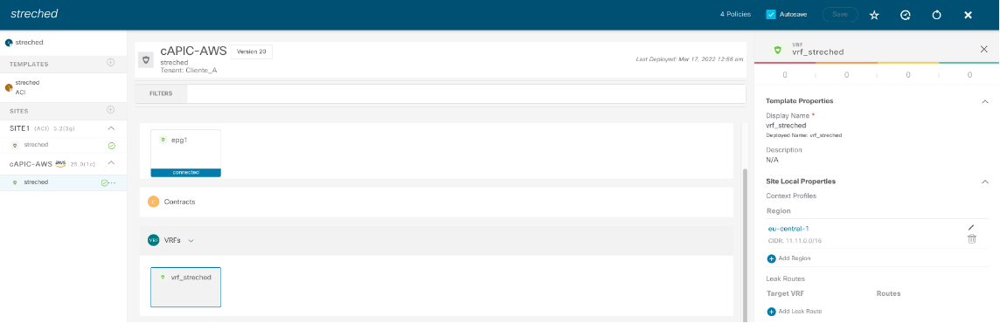

#ACI multi-site network for streched epg use case.

Initialize Terraform:

terraform init

You should see Terraform has been successfully initialized!

Update the variable.tf file wih your data.

Terraform plan is used for change management and lets the user know what will be configured:

terraform plan -parallelism=1

Terraform plan will apply the changes:

terraform apply -parallelism=1

You will see a list of all the resources which are to be created, modified or destroyed

Please enter yes.

#nmarques
